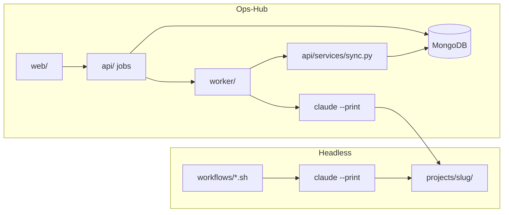

# Architecture

## What the system is

A dual-mode estimating system that turns a bid-set PDF into a reviewable draft
quotation, following the CBC estimator's Phase 0–6 workflow. It drafts, sources,
and calculates. It does not send.

**Headless mode** — `workflows/` invokes `claude --print` directly against the
filesystem layout under `projects/{slug}/`.

**Ops-Hub mode** — the estimator drives the same pipeline through a web app;
FastAPI enqueues jobs, the worker runs Claude, and MongoDB holds structured state
while PDFs stay on disk for the MCP tools.

## Repository layout

```
cbc-copilot-claude-cli/
├── CLAUDE.md                 # Project index
├── .mcp.json                 # MCP server registration (6 servers)
├── .claude/                  # Agents, skills, rules, hooks, memory
├── api/                      # FastAPI — MongoDB, jobs, business rules
├── web/                      # Next.js 15 UI
├── worker/                   # Job runner (claude --print + disk sync)
├── mcp-servers/              # 6 stdio MCP tool providers
├── workflows/                # Headless phase scripts
├── docker/                   # Container entrypoint, LiteLLM config
├── docs/                     # Human documentation + docs/bootstrap/
├── scripts/                  # Repo utilities
├── tests/                    # Unified pytest tree
│   ├── pipeline/             # MCP, guardrail, extraction tests
│   ├── api/                  # Ops-Hub API tests
│   └── fixtures/             # PDFs and frozen project JSON
├── projects/                 # Runtime bid workspaces (demo committed)
├── pricebooks/               # Normalized vendor files (runtime)
├── final_pricebooks/         # Raw vendor uploads (source)
├── reference-library/        # Structured JSON reference data
└── templates/                # Jinja2/HTML output templates
```

## The seven Claude layers

```
                      CLAUDE CODE CLI
            (headless workflows/  OR  Ops-Hub worker/)

   WORKFLOWS ──────▶ AGENTS ──────▶ SKILLS
   (orchestrate)     (10 roles)     (9 tasks)
                                        │
        ┌───────────────────────────────┘
        ▼
   MCP SERVERS       MEMORY          RULES
   (6 providers)     (13 files)      (8 constraints)
        │
        ▼
   GUARDRAILS  ◀── hooks fire on every tool call
   (5 hooks)       PreToolUse: block  /  PostToolUse: validate + log

   CLAUDE.md ── the index that ties the layers together

        │
        ▼
   PROJECTS/          PRICEBOOKS/        REFERENCE-LIBRARY/
   (per-bid data)     (26 vendor files)  (structured JSON)
```

| Layer | Path | Count | Role |
|---|---|---|---|
| Agents | `.claude/agents/` | 10 | One sub-agent per phase (+ pricebook-ingestor for Ops-Hub) |
| Skills | `.claude/skills/` | 9 | Reusable task workflows with scripts and references |
| Rules | `.claude/rules/` | 8 | Auto-loaded constraints that shape every session |
| Guardrails | `.claude/hooks/` | 5 | Executable hooks that block or log tool calls |
| Memory | `.claude/memory/` | 13 | Persistent reference data and business rules |
| MCP servers | `mcp-servers/` | 6 | External tool providers over stdio |
| Workflows | `workflows/` | 9 scripts | Headless orchestration |

## Ops-Hub stack

| Component | Path | Role |
|---|---|---|
| API | `api/` | FastAPI. Owns MongoDB, jobs, quote rules. Delegates arithmetic to `calc-engine`. |
| Web | `web/` | Next.js UI — dashboard, bid board, catalog, price books, settings. |
| Worker | `worker/` | Claims queued jobs, runs `claude --print`, syncs disk → MongoDB. |
| Docker | `docker/`, root `Dockerfile`, `docker-compose.yml` | Five containers: web, api, worker, mongo, litellm. |

Setup: `docs/opshub_setup.md`

### Dual execution paths



At phase boundaries the API exports estimator-confirmed state to `extracted/` and
`priced/` before the next Claude job, and imports Claude output back into MongoDB
when a job completes.

## Data flow (filesystem)

```
uploads/raw/*.pdf
    │
    ├─▶ intake-coordinator ──▶ extracted/scope_metadata.json
    ├─▶ spec-scope-analyst ──▶ extracted/scope_summary.json
    ├─▶ takeoff-engineer   ──▶ extracted/door_schedule.json
    ├─▶ frp-specialist     ──▶ extracted/frp_takeoff.json
    │
    ▼
product-matcher ──▶ extracted/hardware_sets.json
    │
    ▼
pricing-engineer ──▶ priced/line_items.json + priced/margin_applied.json
    │                (reads pricebook, catalog, p21-connector, calc-engine)
    ▼
quote-builder ──▶ quotation.html
    │
    ▼
quality-reviewer ──▶ review/review_flags.json + review/review_summary.html
    │
    ▼
delivery-agent ──▶ quotation.pdf + uploads/final/
    │
    ▼
  HALT: "Draft ready for estimator review"

(every step appends to audit_trail.jsonl via the log_audit_trail hook)
```

## Phase-to-component map

| CBC phase | Agent | Skills | MCP servers | Guardrail |
|---|---|---|---|---|
| 0/1 Intake and file setup | intake-coordinator | - | artifact-storage | file-safety |
| 2 Spec scoping | spec-scope-analyst | extract-door-schedule | pdf-tools | auditability, scope-boundaries |
| 3 Take-offs | takeoff-engineer | extract-door-schedule, validate-extraction | pdf-tools | accuracy-trust |
| 3b FRP | frp-specialist | frp-takeoff | pdf-tools | accuracy-trust |
| 4 Matching | product-matcher | match-hardware-sets, scan-product-catalog | pricebook, catalog | accuracy-trust |
| 4 Pricing | pricing-engineer | price-line-item, apply-margin | pricebook, catalog, p21-connector, calc-engine | p21-read-only, margin-governance |
| 4/6 Quote build | quote-builder | generate-quotation | calc-engine, artifact-storage | auditability |
| 5 Review | quality-reviewer | validate-extraction, reuse-prior-quote | - | human-in-the-loop |
| 6 Deliver | delivery-agent | generate-quotation | artifact-storage | human-in-the-loop |
| *(Ops-Hub)* Price book ingest | pricebook-ingestor | scan-product-catalog | pricebook, catalog | file-safety |

## Hook execution lifecycle

| Event | Matcher | Hooks | Effect |
|---|---|---|---|
| PreToolUse | `Bash` | `pre_send_quote.py`, `pre_delete_guard.py` | Exit 2 blocks the call |
| PostToolUse | `Write\|Edit` | `post_extraction_validate.py`, `post_quote_format.py` | Warn only, never block |
| PostToolUse | `*` | `log_audit_trail.py` | Always exit 0; appends JSONL |

Hooks are Python, not shell. `jq` is not installed on the target machine, so
jq-based hooks would fail open — a guardrail that silently stops guarding is worse
than no guardrail.

## Runtime-only paths

| Path | Purpose |
|---|---|
| `projects/*/.runs/` | Terminal recordings per job (gitignored) |
| `projects/*/.versions/` | Artifact-storage SHA history (gitignored) |
| `storage/` | Reserved runtime placeholder (gitignored; unused today) |
| `tests/fixtures/scratch/` | Isolated storage for API tests (gitignored) |

## Key technical decisions

**Word-position clustering, not table detection.** Architectural bid sets are CAD
exports. Clustering `page.get_text("words")` by y-coordinate recovers door schedules
and hardware groups cleanly.

**stdlib `difflib`, not rapidfuzz.** Part-number matching is containment-first;
the extra dependency did not earn its place.

**One arithmetic implementation.** All quote math lives in `calc-engine`. Nothing
else totals, applies a margin, or computes tax.

**`_runtime.py` holds the MCP protocol wiring** shared by all six servers, so each
`server.py` is domain logic plus a `TOOLS` list and a `HANDLERS` map.

**OCR is optional and lazy.** `pytesseract` is imported only when a page has no
extractable text.

## Where the system deliberately stops

- Beyond the top-10 stock items: MANUAL path (NR-13).
- Fire-rating rules: PENDING (Matrix 7.3).
- FRP conversion constants: PENDING (Open Item 5).
- Alternates and addenda: PENDING (Matrix 4.1 / FR-14).
- Margin approval routing: deferred (NFR-8).
- Sending anything, ever: NFR-1.
