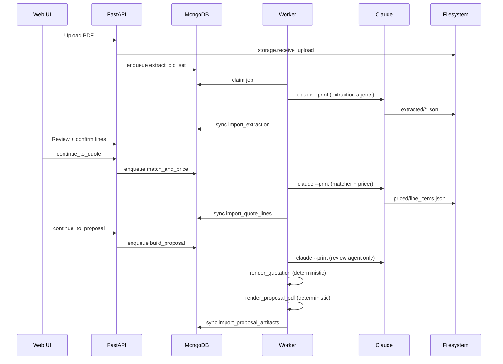

# CBC Estimating Copilot — Target Architecture

**Audit date:** 2026-09-01  
**Principle:** Simple modular monolith. Complexity must justify itself.

---

## 1. Architecture Overview

```
┌─────────────────────────────────────────────────────────────────┐
│                         Estimator Browser                        │
└─────────────────────────────┬───────────────────────────────────┘
                              │ HTTPS
┌─────────────────────────────▼───────────────────────────────────┐
│  web/ (Next.js 16)                                               │
│  ├── NextAuth (session JWT)                                      │
│  ├── /api/proxy/* → internal token + actor                       │
│  └── Server components → direct API for SSR                        │
└─────────────────────────────┬───────────────────────────────────┘
                              │ Docker internal network (prod)
┌─────────────────────────────▼───────────────────────────────────┐
│  apps/api/ (FastAPI)                                             │
│  ├── InternalAuthMiddleware                                      │
│  ├── Routers (CRUD, enqueue only — never spawn Claude)           │
│  └── require_admin for destructive/admin ops                     │
└──────────┬──────────────────────────────────┬───────────────────┘
           │                                   │
           ▼                                   ▼
┌──────────────────────┐            ┌──────────────────────────────┐
│  MongoDB              │            │  Filesystem                   │
│  ├── jobs (queue)     │            │  ├── projects/{slug}/         │
│  ├── projects         │            │  ├── pricebooks/              │
│  ├── lineItems        │            │  └── reference-library/       │
│  ├── quoteLines       │            └──────────────────────────────┘
│  ├── pageIndex        │
│  └── auditLog         │
└──────────┬───────────┘
           │
┌──────────▼──────────────────────────────────────────────────────┐
│  apps/worker/ (job runner)                                        │
│  ├── Poll → claim → process → sync → finish                      │
│  ├── Deterministic handlers (index_catalog, render, validate)    │
│  └── Claude jobs (reasoning phases only)                          │
└──────────┬──────────────────────────────────────────────────────┘
           │
┌──────────▼──────────────────────────────────────────────────────┐
│  Claude Code CLI (single spawn: cbc/core/claude_cli.py)          │
│  ├── Per-job MCP scoping (--strict-mcp-config)                    │
│  ├── PreToolUse hooks (send block, delete guard)                  │
│  └── PostToolUse hooks (validation, audit trail)                  │
└──────────┬──────────────────────────────────────────────────────┘
           │
┌──────────▼──────────────────────────────────────────────────────┐
│  MCP Servers (stdio adapters over cbc/core)                      │
│  pdf-tools │ catalog │ calc-engine │ artifact-storage │ p21       │
└─────────────────────────────────────────────────────────────────┘
```

---

## 2. Folder Structure

```
cbc-copilot-claude-code/
├── apps/
│   ├── api/                    # FastAPI — HTTP boundary only
│   │   ├── main.py
│   │   ├── deps.py             # Auth middleware
│   │   └── routers/            # Thin: validate → service → response
│   └── worker/
│       ├── main.py             # Poll loop only
│       ├── prompts.py          # Single prompt source (worker + workflows)
│       └── handlers/           # Deterministic job handlers
├── src/cbc/                    # Domain — imported by apps, never imports apps
│   ├── config.py
│   ├── db.py
│   ├── schemas/
│   ├── services/
│   │   ├── jobs.py
│   │   ├── sync/               # Split: extraction, pricing, proposal, geometry
│   │   ├── quote.py
│   │   ├── pricing.py
│   │   ├── audit.py
│   │   └── provider.py
│   ├── validation/             # Moved from scripts/
│   │   └── artifacts.py
│   ├── core/                   # Pure kernel — no db, no apps imports
│   │   ├── calc.py             # Single money math implementation
│   │   ├── claude_cli.py       # Single Claude spawn point
│   │   ├── toolsets.py         # Per-job MCP scoping (env-only, no db import)
│   │   ├── secrets.py
│   │   └── pdfrows.py
│   └── pageindex/              # Page routing (not RAG)
│       ├── build.py
│       ├── store.py
│       └── query.py
├── web/                        # Next.js Ops-Hub UI
├── mcp-servers/                # Stdio MCP adapters
├── .claude/
│   ├── agents/                 # Reasoning-phase agents only (6, not 10)
│   ├── skills/                 # Executable workflows with scripts
│   ├── rules/                  # Auto-loaded constraints
│   ├── hooks/                  # Executable guardrails
│   └── memory/                 # Pointers to reference-library/ (not duplicates)
├── reference-library/          # Canonical JSON reference data
├── workflows/                  # Headless shell (same tool scoping as worker)
├── projects/                   # Runtime bid workspaces
├── pricebooks/                 # Vendor PDF sheets
├── tests/                      # Unified pytest
├── scripts/                    # CLI utilities (not imported by worker)
└── docs/
    └── audit/                  # This audit package
```

---

## 3. Component Boundaries

### Dependency Rule (unchanged)

```
apps/api  ──┐
            ├──→ src/cbc ──→ (nothing above)
apps/worker ┘

mcp-servers ──→ src/cbc/core (adapters only)

web ──→ apps/api (via HTTP proxy, never imports cbc)
```

Enforced by `tests/api/test_layering.py`.

### API Boundary

| Responsibility | In API | Not in API |
|----------------|--------|------------|
| Request validation | Yes | |
| Auth/authz | Yes | |
| Job enqueue | Yes | |
| Claude spawn | | Yes — worker only |
| Business rules | Delegate to `cbc/services` | |
| Direct filesystem writes | Via `storage` service only | |

### Worker Boundary

| Job Type | Handler | Claude? |
|----------|---------|---------|
| extract_bid_set | prompts + sync | Yes |
| rerun_extraction | prompts + sync | Yes |
| match_and_price | prompts + sync | Yes |
| build_proposal | prompts + sync + **render service** | Partial |
| run_full_pipeline | prompts + sync | Yes |
| ingest_addendum | prompts + sync | Yes |
| ingest_pricebook | prompts + ingest handler | Yes (fallback) |
| index_catalog | catalog handler | **No** |
| delete_catalog | catalog handler | **No** |
| render_quotation | **new deterministic handler** | **No** |
| validate_artifacts | **new deterministic handler** | **No** |

---

## 4. Agent Boundaries (Target: 6 Agents)

Agents retained only where LLM reasoning is genuinely required.

| Agent | Phases | Why Agent |
|-------|--------|-----------|
| intake-coordinator | 0/1 | Metadata extraction from unstructured PDFs |
| spec-scope-analyst | 2 | Scope interpretation, out-of-scope judgment |
| takeoff-engineer | 3 | Sheet location, handing inference, reconciliation |
| frp-specialist | 3b | Geometry capture from drawings |
| product-matcher | 4a | Matching ladder, substitution judgment |
| pricing-engineer | 4b | Cost path selection, PDF price reading |

### Converted to Deterministic Services

| Former Agent | Service | Implementation |
|--------------|---------|----------------|
| quote-builder | `cbc/services/render.py` | `validate_and_render_quote.py` |
| quality-reviewer | `cbc/validation/review.py` | Flag rules + `render_review_summary.py` |
| delivery-agent | `cbc/services/delivery.py` | WeasyPrint PDF + template fill + file copy |
| pricebook-ingestor | `pageindex/build.py` | Primary path; LLM ingest as fallback only |

---

## 5. Service Boundaries

### `cbc/services/sync/` (split from monolith)

| Module | Responsibility |
|--------|----------------|
| `extraction.py` | `import_extraction`, `export_line_items`, scope metadata |
| `pricing.py` | `import_quote_lines`, `export_quote_lines` |
| `proposal.py` | `import_proposal_artifacts` |
| `geometry.py` | `measure_bboxes`, `derive_frame_depths` |
| `orchestrator.py` | `sync_results(job_type, slug)` — called by worker |

### `cbc/validation/`

| Module | Responsibility |
|--------|----------------|
| `artifacts.py` | `validate_job_artifacts` — post-Claude gate |
| `review.py` | Deterministic review flag generation |

### `cbc/services/render.py`

| Function | Calls |
|----------|-------|
| `render_quotation(slug)` | `validate_and_render_quote.py` |
| `render_review_summary(slug)` | `render_review_summary.py` |
| `render_proposal_pdf(slug)` | WeasyPrint |

---

## 6. Data Flow

### Gated Pipeline (Estimator-Controlled)



### Autopilot Pipeline

Single Claude session for reasoning phases; deterministic render/validate between phases where possible.

### Pricebook Upload

```
Upload → index_catalog (deterministic, no Claude)
       → pageIndex MongoDB doc
       → catalog MCP find_pages at quote time
       → pdf-tools reads price off sheet
```

No pre-extracted product prices stored (except manual catalog entries in `products` collection).

---

## 7. API Boundaries

### Public (via Next.js proxy)

All `/api/*` except health and auth/verify require `X-Internal-Token` + `X-Actor`.

### Admin-Only

- `settings.py` (all routes)
- `users.py`
- `audit_log.py`
- Price book delete
- Reference data PATCH

### Estimator-Accessible

- Projects, documents, line items, quote, proposal
- Jobs (enqueue, cancel, status)
- Catalog read, integrations status

---

## 8. Database Ownership

| Collection | Writer | Reader |
|------------|--------|--------|
| users | API (admin) | API (auth) |
| projects | API, worker (stage) | API, worker |
| documents | API | API, worker |
| lineItems | worker (sync) | API |
| quoteLines | worker (sync), API (edits) | API |
| quotes | worker, API (reprice) | API |
| proposals | worker (sync) | API |
| jobs | API (enqueue), worker (status) | API, worker |
| pageIndex | worker (index_catalog) | API, catalog MCP (readonly) |
| products | worker (ingest), API (manual) | API, catalog MCP |
| priceBooks | API, worker (index status) | API |
| auditLog | API (audit service) | API (admin) |
| settings | API (admin) | API, worker |

---

## 9. Background Job Architecture

### Queue Model (unchanged)

- MongoDB `jobs` collection as queue
- Atomic claim via `find_one_and_update`
- Heartbeat every 30s; stale reaper at 90s
- Exponential backoff retry (max 3)
- Partial unique index for exclusive job types

### Target Improvements

| Improvement | Implementation |
|-------------|----------------|
| Per-phase validation in autopilot | Validate after each phase artifact write |
| Deterministic interludes | Render/validate without Claude between phases |
| Job metrics | MongoDB aggregation on jobs collection |
| Coalesced indexing | Skip index_catalog if hash unchanged |

---

## 10. PageIndex Architecture (Not RAG)

```
┌─────────────┐     ┌──────────────┐     ┌─────────────┐
│ pricebooks/ │────→│ build_one()  │────→│ pageIndex   │
│ *.pdf       │     │ (deterministic│     │ (MongoDB)   │
└─────────────┘     │  + optional  │     └──────┬──────┘
                    │  LLM profile)│            │
                    └──────────────┘            │
                                                ▼
                    ┌──────────────┐     ┌─────────────┐
                    │ pdf-tools    │←────│ find_pages  │
                    │ (read price) │     │ (keyword    │
                    └──────────────┘     │  scoring)   │
                                         └─────────────┘
```

**No embeddings. No vector DB. No pre-extracted prices.**

Scaling plan: At 50+ catalogs, evaluate MongoDB `$text` search vs in-memory Python scoring.

---

## 11. Observability

### Target State

| Layer | Mechanism |
|-------|-----------|
| Logs | JSON structured logging with job_id, project_code, actor |
| Errors | Sentry or equivalent for API + worker |
| Metrics | Job queue depth, duration, failure rate (admin endpoint) |
| Tracing | OpenTelemetry for API request spans (future) |
| Audit | MongoDB auditLog + per-project audit_trail.jsonl (existing) |
| Terminal | SSE stream of job recordings (existing) |

### Health Endpoint (existing)

`GET /api/health` → database, storage, catalogIndex, sends status.

---

## 12. Security Boundaries

```
┌─────────────────────────────────────────────────┐
│  Public Internet                                 │
│  └── Only web:3000 (Next.js)                     │
└────────────────────┬────────────────────────────┘
                     │
┌────────────────────▼────────────────────────────┐
│  Docker Internal Network                         │
│  ├── web → api:8001 (X-Internal-Token)           │
│  ├── worker → mongo (writable)                   │
│  ├── api → mongo (writable)                      │
│  └── catalog MCP → mongo (readonly URI only)     │
└─────────────────────────────────────────────────┘

Claude subprocess:
  ├── MONGODB_URI withheld (provider.WITHHELD)
  ├── Per-job MCP tool scoping
  ├── PreToolUse hooks (send block, delete guard)
  └── --dangerously-skip-permissions (accepted risk, hook-dependent)
```

### Secrets

| Secret | Storage | Access |
|--------|---------|--------|
| INTERNAL_API_TOKEN | Env / Secrets Manager | web, api |
| APP_SECRET_KEY | Env / Secrets Manager | Fernet encrypt for provider creds |
| MONGODB_URI | Env | api, worker (not Claude) |
| MONGODB_READONLY_URI | Env | catalog MCP only |
| Provider credentials | MongoDB settings (encrypted) | worker per job |

---

## 13. What We Are Not Building

| Avoided | Reason |
|---------|--------|
| Microservices | Single team, shared deployment; modular monolith sufficient |
| Vector RAG | PageIndex routing is correct for vendor PDF pricing |
| Event bus | MongoDB job queue is adequate |
| Multiple Claude spawn points | Already unified in claude_cli.py |
| 10 agents | 6 agents + 4 services is simpler and more reliable |
| Pre-extracted price tables | Caused 37.8% bad codes in prior FTS5 approach |

---

## 14. Migration Path Summary

1. **Immediate:** Dead code removal, prompt fixes, toolset fixes (Phase 1)
2. **Short-term:** Security hardening, docs rewrite, reference data consolidation (Phases 2, 4, 9)
3. **Medium-term:** Agent→service conversion for render/review/delivery (Phase 3)
4. **Long-term:** Observability, scaling evaluation, FR-14 when CBC decides (Phases 6-8)

Target state achieves: **correct, simple, reliable, secure, observable, maintainable, testable, scalable** — without unnecessary distributed complexity.
